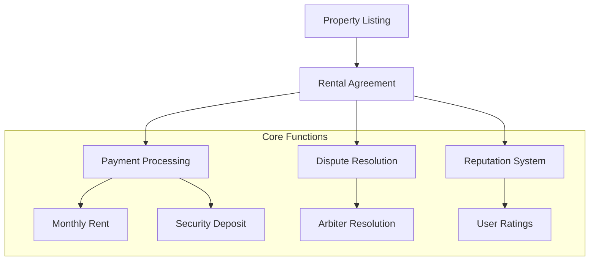

# FairNest Rental Marketplace

A decentralized rental marketplace built on the Stacks blockchain that connects landlords and tenants in a trustless environment.

## Overview

FairNest eliminates traditional intermediaries while providing robust protections for both parties through smart contracts. The platform enables:

- Property owners to list rentals, set terms, and collect payments automatically
- Tenants to browse listings, submit applications, and make payments directly
- Automated deposit handling and rent collection
- Transparent dispute resolution system
- Reputation system for building trust

## Architecture



The system consists of several interconnected components:
1. Property Listings Management
2. Rental Agreement Handling
3. Payment Processing
4. Dispute Resolution
5. Reputation System

## Contract Documentation

### Property Listings
- Managed through `property-listings` data map
- Stores property details, pricing, and availability status
- Functions include:
  - `create-listing`
  - `update-listing`
  - `change-listing-status`

### Rental Agreements
- Tracked in `rental-agreements` data map
- Manages active rentals between landlords and tenants
- Key functions:
  - `create-rental-agreement`
  - `pay-rent`
  - `complete-agreement`

### Dispute Resolution
- Handled through `disputes` data map
- Authorized arbiters can resolve conflicts
- Functions:
  - `file-dispute`
  - `resolve-dispute`

### Reputation System
- Stored in `user-reputations` data map
- Tracks user ratings and reviews
- Function: `rate-user`

## Getting Started

### Prerequisites
- Clarinet CLI
- Stacks wallet
- STX tokens for transactions

### Installation
1. Clone the repository
2. Install dependencies with Clarinet
3. Deploy contracts to your chosen network

### Basic Usage

1. **List a Property**
```clarity
(contract-call? 
  .fairnest-marketplace 
  create-listing 
  "Luxury Apartment" 
  "Modern 2-bedroom" 
  "Manhattan, NY" 
  u2000000 ;; 2000 STX per month
  u4000000 ;; 4000 STX deposit
  u6 ;; minimum 6 months
  u24 ;; maximum 24 months
  (list "parking" "pool")
)
```

2. **Create Rental Agreement**
```clarity
(contract-call? 
  .fairnest-marketplace 
  create-rental-agreement 
  u1 ;; listing-id
  u100000 ;; start block
  u200000 ;; end block
  u4000000 ;; deposit amount
)
```

3. **Pay Monthly Rent**
```clarity
(contract-call? 
  .fairnest-marketplace 
  pay-rent 
  u1 ;; agreement-id
)
```

## Function Reference

### Public Functions

#### Property Management
- `create-listing`: Create new property listing
- `update-listing`: Update existing listing
- `change-listing-status`: Change listing availability

#### Rental Agreements
- `create-rental-agreement`: Start new rental
- `pay-rent`: Process monthly payment
- `complete-agreement`: End rental agreement

#### Dispute Handling
- `file-dispute`: Open new dispute
- `resolve-dispute`: Resolve open dispute

#### Reputation
- `rate-user`: Rate transaction counterparty

### Read-Only Functions
- `get-listing`: Get listing details
- `get-rental-agreement`: Get agreement details
- `get-payment-history`: View payment records
- `get-user-reputation`: Check user ratings

## Development

### Testing
Run tests using Clarinet:
```bash
clarinet test
```

### Local Development
1. Start Clarinet console:
```bash
clarinet console
```
2. Deploy contracts
3. Interact using contract calls

## Security Considerations

### Limitations
- Requires STX for transactions
- Dispute resolution relies on authorized arbiters
- Agreement modifications require new agreement creation

### Best Practices
- Always verify agreement terms before signing
- Keep private keys secure
- Monitor agreement status and payment dates
- Review counterparty reputation before engaging
- Document all communications regarding disputes

### Platform Fees
- Platform charges 2.5% fee on rent payments
- Fees can be adjusted by contract owner
- Maximum fee capped at 10%